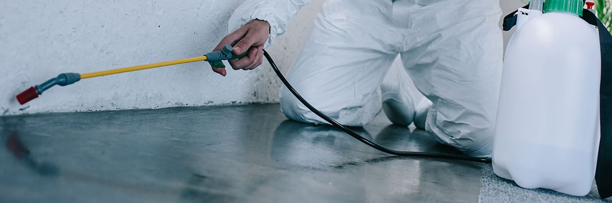
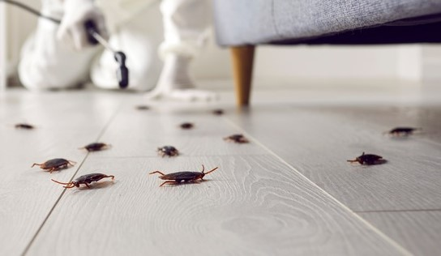

<html lang="en">
<head>
  <meta charset="UTF-8" />
  <meta name="viewport" content="width=device-width, initial-scale=1.0" />
  <title>PCS - Pest Control Services</title>
  
</head>
<body>

  <header>
    
    

      <h1>PCS</h1>
      Pest Control Services
    

  </header>

  

    <h2>About Us</h2>
    

      PCS is a trusted American  pest control company, dedicated to protecting homes and businesses from unwanted pests. With a team of licensed professionals and eco-safe methods, we deliver fast, reliable, and long-lasting pest management solutions across the country.
      At PCS Pest Control Services, we are committed to providing reliable, eco-friendly, and professional pest management solutions across louisiana , California , los angeles. Our experienced team specializes in the safe removal and prevention of common pests such as termites, rodents, cockroaches, ants, and spiders in addition we provide general maintenance services. We serve both residential and commercial properties, using advanced techniques and environmentally safe products to ensure long-lasting protection. At PCS, customer satisfaction is our top priority, which is why we offer flexible scheduling, thorough inspections, and tailored treatment plans to suit every need. Whether it's a one-time service or a long-term maintenance plan, PCS is your trusted partner in creating pest-free environments.
    

  

  

    <h2>Our Services</h2>
    <ul>
      <li>Home Pest Control</li>
      <li>Commercial Pest Management</li>
      <li>Termite Inspection & Treatment</li>
      <li>Rodent and Cockroach Removal</li>
      <li>Preventive Treatments</li>
    </ul>
  

  

    <h2> </h2>
    
    
  

  

    <h2>Contact Us</h2>
    
📧 Email: <a href="mailto:carla.miller.pcs@gmail.com">carla.miller.pcs@gmail.com</a>

    <button class="button" onclick="contactMessage()">Send Inquiry</button>
  

  <footer>
    &copy; 2025 PCS USA - All rights reserved.
  </footer>

  

</body>
</html>
